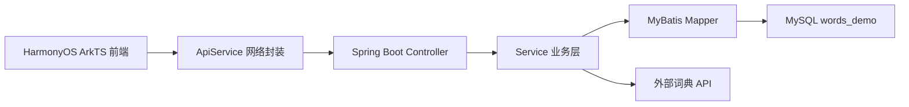
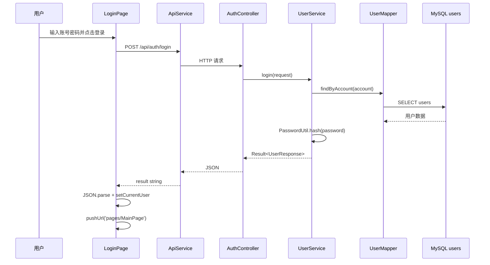
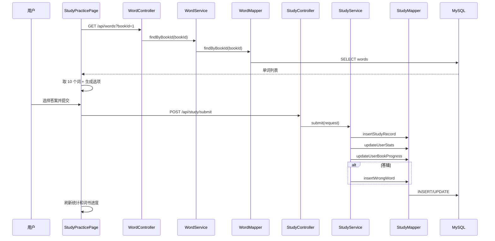

# 鸿蒙背单词 App 技术说明文档

## 1. 项目定位

本项目是一个前后端分离的背单词学习 App，前端使用 HarmonyOS ArkTS/ArkUI 编写，后端使用 Spring Boot + MyBatis + MySQL 提供真实接口和数据持久化。

核心功能包括：

- 用户注册、登录、退出登录。
- 三本词书：四级高频词汇、六级高频词汇、考研核心词汇。
- 每本词书当前都有 300 个本地词库单词，共 900 个单词。
- 背词练习：一组 10 个单词，四选一答题。
- 学习提交：答题后写入学习记录，更新用户统计和词书进度。
- 错题本：答错的单词自动进入错题本。
- 生词本：用户手动加入生词本，后端做重复判断。
- 签到：今日签到状态查询和签到提交。
- 学习记录页：展示连续学习天数、累计完成词数、平均正确率、本月学习日历。
- 词书页：展示词书列表、总词数、已学数、待复习数、学习进度。
- 我的页：展示用户、我的生词本、错题本、学习记录、个人资料入口。

## 2. 项目目录

项目根目录：

```text
E:\DevEcoStudioProjects\demo
```

前端目录：

```text
E:\DevEcoStudioProjects\demo\demo
```

后端目录：

```text
E:\DevEcoStudioProjects\demo\demo_backend
```

主要文件：

```text
demo
├─ entry/src/main/ets
│  ├─ api
│  │  ├─ ApiConfig.ets
│  │  └─ ApiService.ets
│  ├─ data
│  │  ├─ AppState.ets
│  │  └─ CurrentUser.ets
│  ├─ entryability
│  │  └─ EntryAbility.ets
│  ├─ pages
│  │  ├─ LoginPage.ets
│  │  ├─ RegisterPage.ets
│  │  ├─ MainPage.ets
│  │  ├─ CollectionPage.ets
│  │  ├─ WrongBookPage.ets
│  │  ├─ StudyRecordPage.ets
│  │  └─ ProfilePage.ets
│  └─ utils
│     └─ UiFeedback.ets
└─ entry/src/main/module.json5

demo_backend
├─ src/main/java/org/example/demo_backend
│  ├─ controller
│  ├─ service
│  ├─ mapper
│  ├─ entity
│  ├─ dto
│  ├─ common
│  └─ util
└─ src/main/resources
   ├─ application.properties
   └─ db
      ├─ init_words_demo.sql
      ├─ seed_10_words.sql
      └─ import_ecdict_words.sql
```

## 3. 技术栈

前端：

- HarmonyOS ArkTS。
- ArkUI 声明式 UI。
- `@Entry`、`@Component`、`@State`、`@Link`、`@Builder`。
- `@kit.NetworkKit` 的 `http.createHttp()` 发起网络请求。
- `@kit.ArkUI` 的 `UIContext` 做 Toast 和路由跳转。
- `@kit.ArkData` 的 `preferences` 保存当前登录用户。

后端：

- Spring Boot 4.0.5。
- Java 17。
- Spring MVC Controller 提供 REST API。
- MyBatis 注解 SQL 操作 MySQL。
- Lombok 简化实体类 getter/setter。
- MySQL 8 张业务表。
- WebClient 调用外部词典 API。

数据库：

- MySQL 数据库名：`words_demo`。
- 当前词库数据：3 本词书，每本 300 个单词。
- 本地连接用户：`root`。
- 本地连接密码：`1321A30`。

## 4. 总体架构



说明：

- 前端不直接访问数据库，只访问后端 HTTP 接口。
- 后端 Controller 接收请求，Service 处理业务逻辑，Mapper 执行 SQL。
- 数据最终保存在 MySQL。
- 外部 API 主要用于查词和补充词库信息，不是前端直接调用。

## 5. 前端启动流程

启动入口文件：

```text
E:\DevEcoStudioProjects\demo\demo\entry\src\main\ets\entryability\EntryAbility.ets
```

核心逻辑：

```text
onWindowStageCreate()
  -> initCurrentUserStorage(this.context)
  -> windowStage.loadContent('pages/LoginPage')
```

也就是说，App 每次启动先加载登录页。

页面注册文件：

```text
E:\DevEcoStudioProjects\demo\demo\entry\src\main\resources\base\profile\main_pages.json
```

其中注册了：

```text
pages/LoginPage
pages/RegisterPage
pages/MainPage
pages/CollectionPage
pages/WrongBookPage
pages/StudyRecordPage
pages/ProfilePage
```

网络权限配置：

```text
E:\DevEcoStudioProjects\demo\demo\entry\src\main\module.json5
```

里面配置了：

```json
"requestPermissions": [
  {
    "name": "ohos.permission.INTERNET"
  }
]
```

这个权限是前端访问 Spring Boot 接口必须要有的。

## 6. 前端网络请求封装

文件：

```text
E:\DevEcoStudioProjects\demo\demo\entry\src\main\ets\api\ApiConfig.ets
E:\DevEcoStudioProjects\demo\demo\entry\src\main\ets\api\ApiService.ets
```

`ApiConfig.ets`：

```ts
export const API_BASE_URL: string = 'http://172.18.32.1:8080';
```

这个地址是前端访问后端的基础地址。虚拟机能访问电脑后端时用这个地址。如果换真机，一般要改成电脑 WLAN IPv4 地址。

`ApiService.ets` 封装了四种方法：

```ts
ApiService.get(path)
ApiService.post(path, body)
ApiService.put(path, body)
ApiService.delete(path)
```

底层调用：

```ts
http.createHttp().request(BASE_URL + path, options, callback)
```

统一设置：

- `connectTimeout: 15000`
- `readTimeout: 15000`
- POST/PUT 请求头：`Content-Type: application/json`
- 请求体使用 `JSON.stringify(body)`
- 返回值是 `Promise<string>`

前端页面拿到结果后一般这样处理：

```ts
ApiService.get('/api/books/progress?userId=' + currentUser.id)
  .then((result: string) => {
    const response = JSON.parse(result) as BookProgressResponse;
  });
```

## 7. 前端状态管理

### 7.1 全局用户资料

文件：

```text
E:\DevEcoStudioProjects\demo\demo\entry\src\main\ets\data\AppState.ets
```

主要接口：

```ts
BookCard
LearningWord
StudyRecord
UserProfile
```

主要全局变量：

```ts
export const userProfile: UserProfile = {
  nickname: '',
  dailyTarget: 30,
  signature: '',
  selectedBookId: 1,
  totalLearnedWords: 0,
  streakDays: 0,
  accuracyRate: 0,
  reviewDue: 0
};
```

作用：

- 保存当前用户昵称、每日目标、默认词书、累计学习数、连续天数、正确率等。
- 登录成功、主页加载、个人资料修改后都会更新它。

### 7.2 当前登录用户

文件：

```text
E:\DevEcoStudioProjects\demo\demo\entry\src\main\ets\data\CurrentUser.ets
```

核心对象：

```ts
export const currentUser: CurrentUser = new CurrentUser();
```

默认值：

```ts
id = 1
account = 'demo_user'
nickname = 'Morning Reader'
isLoggedIn = false
```

核心方法：

```ts
initCurrentUserStorage(context)
setCurrentUser(id, account, nickname)
resetCurrentUser()
```

使用的持久化方式：

```ts
preferences.getPreferencesSync(context, { name: 'current_user' })
```

作用：

- 登录成功后调用 `setCurrentUser()` 保存用户 ID、账号、昵称。
- 退出登录时调用 `resetCurrentUser()`。
- App 启动时调用 `initCurrentUserStorage()` 读取本地保存过的用户信息。

## 8. 前端页面说明

### 8.1 登录页 LoginPage

文件：

```text
E:\DevEcoStudioProjects\demo\demo\entry\src\main\ets\pages\LoginPage.ets
```

使用的主要组件：

- `Column`：纵向布局。
- `Row`：横向布局。
- `Blank`：撑开空白空间。
- `Text`：标题、提示文字。
- `TextInput`：账号和密码输入框。
- `Button`：登录按钮。

状态变量：

```ts
@State account: string = '';
@State password: string = '';
```

登录按钮逻辑：

```text
点击登录
  -> 检查账号和密码是否为空
  -> 组装 LoginRequestBody
  -> ApiService.post('/api/auth/login', requestBody)
  -> JSON.parse 后端返回
  -> code 不是 200 就 showToast
  -> code 是 200：
       更新 userProfile
       setCurrentUser()
       pushUrl('pages/MainPage')
```

调用接口：

```http
POST /api/auth/login
```

请求体：

```json
{
  "account": "demo_user",
  "password": "123456"
}
```

成功返回后会进入主页。

### 8.2 注册页 RegisterPage

文件：

```text
E:\DevEcoStudioProjects\demo\demo\entry\src\main\ets\pages\RegisterPage.ets
```

使用的主要组件：

- `Column`
- `Row`
- `Text`
- `TextInput`
- `Button`

状态变量：

```ts
@State account
@State nickname
@State password
@State confirmPassword
```

注册逻辑：

```text
点击注册并登录
  -> 检查账号是否为空
  -> 检查密码长度至少 6 位
  -> 检查两次密码是否一致
  -> ApiService.post('/api/auth/register', requestBody)
  -> 注册成功后 setCurrentUser()
  -> pushUrl('pages/MainPage')
```

调用接口：

```http
POST /api/auth/register
```

### 8.3 主页 MainPage

文件：

```text
E:\DevEcoStudioProjects\demo\demo\entry\src\main\ets\pages\MainPage.ets
```

`MainPage` 是前端最核心的文件，内部拆成多个组件：

```text
MainPage
├─ StudyHomeTab      背词首页
├─ StudyPracticePage 背词练习页
├─ BookTab           词书页
└─ MineTab           我的页
```

`MainPage` 使用的核心组件：

- `Tabs`：底部三栏导航。
- `TabContent`：每个 Tab 的内容。
- `Scroll`：页面滚动。
- `Column`、`Row`：布局。
- `Text`、`Button`、`Progress`、`Swiper`、`Image`。

`MainPage` 的主要状态：

```ts
@State currentTabIndex: number = 0;
@State selectedBookId: number = userProfile.selectedBookId;
@State showPracticePage: boolean = false;
@State practiceMode: string = 'learn';
@State bookList: BookCard[] = [];
@State notebookCount: number = 0;
@State wrongCount: number = 0;
@State studyRecordCount: number = 0;
@State totalLearnedWords: number = userProfile.totalLearnedWords;
@State streakDays: number = userProfile.streakDays;
@State accuracyRate: number = userProfile.accuracyRate;
@State reviewDue: number = userProfile.reviewDue;
@State todayFinishedWords: number = 0;
@State todayCorrectRate: number = 0;
```

`@State` 是组件自己的响应式状态。数据改变后，界面自动刷新。

`@Link` 是子组件和父组件共享状态。比如 `StudyHomeTab` 修改 `showPracticePage`，父组件也会跟着变，所以能切换到练习页。

主页加载逻辑：

```text
MainPage onAppear
  -> loadProfileAndStats()
  -> loadBookProgress()
  -> loadMineCounts()
```

调用接口：

```http
GET /api/user/profile?userId=当前用户ID
GET /api/stats/overview?userId=当前用户ID
GET /api/books/progress?userId=当前用户ID
GET /api/notebook-words?userId=当前用户ID
GET /api/wrong-words?userId=当前用户ID
GET /api/study-records?userId=当前用户ID
```

### 8.4 背词首页 StudyHomeTab

所在文件：

```text
E:\DevEcoStudioProjects\demo\demo\entry\src\main\ets\pages\MainPage.ets
```

主要显示内容：

- 签到卡片。
- Learn：当前词书剩余未学单词数。
- Review：当前词书待复习数。
- 打开词书列表按钮。
- 今日学习概览。

核心方法：

```ts
currentBook()
remainingLearnWords()
currentReviewWords()
dateText()
openBooks()
openPractice(mode)
loadSignStatus()
signToday()
calendarIcon()
focusCard()
metricCard()
```

`remainingLearnWords()` 逻辑：

```text
当前词书未学数 = 当前词书 totalWords - 当前词书 learnedWords
如果词书数据还没加载出来，就用 300 - totalLearnedWords 做兜底
```

`currentReviewWords()` 逻辑：

```text
优先使用当前词书 todayReview
如果词书数据没加载出来，就使用用户 reviewDue 兜底
```

签到逻辑：

```text
页面出现
  -> loadSignStatus()
  -> GET /api/sign/status?userId=当前用户ID
  -> 设置 signedIn

点击签到
  -> 如果 signedIn=true，提示今天已签到
  -> 如果 signedIn=false，POST /api/sign?userId=当前用户ID
  -> 成功后 signedIn=true，界面从日历图标变成 √
```

调用接口：

```http
GET /api/sign/status?userId=1
POST /api/sign?userId=1
```

### 8.5 背词练习页 StudyPracticePage

所在文件：

```text
E:\DevEcoStudioProjects\demo\demo\entry\src\main\ets\pages\MainPage.ets
```

进入方式：

```text
点击 Learn 或 Review
  -> openPractice('learn') 或 openPractice('review')
  -> this.showPracticePage = true
  -> MainPage build() 渲染 StudyPracticePage
```

主要状态：

```ts
@State currentIndex: number = 0;
@State selectedOption: string = '';
@State wordBank: LearningWord[] = [];
@State currentQuestion: LearningWord | null = null;
@State loading: boolean = false;
```

核心方法：

```ts
loadWordBank()
buildPracticeGroup()
buildOptions()
shuffleOptions()
attachOptions()
mapWordItem()
chooseOption()
submitAndNext()
addToNotebook()
refreshStatsAfterSubmit()
refreshBookProgressAfterSubmit()
exitPractice()
```

加载单词逻辑：

```text
StudyPracticePage onAppear
  -> loadWordBank()
  -> GET /api/words?bookId=当前词书ID
  -> 后端返回该词书全部单词
  -> mapWordItem() 转成前端 LearningWord
  -> buildPracticeGroup() 取当前一组 10 个单词
  -> attachOptions() 为每个单词生成 4 个选项
  -> currentQuestion 指向第 1 个题目
```

选项生成逻辑：

```text
buildOptions(correctAnswer, sourceWords)
  -> 先把正确答案放进数组
  -> 从同一本词书的其他单词里取不同 meaning 作为干扰项
  -> 最多凑够 4 个选项
  -> shuffleOptions() 打乱顺序
```

提交答题逻辑：

```text
点击提交下一题
  -> 如果没选答案，提示先选择答案
  -> 判断 selectedOption === word.answer
  -> 组装 StudySubmitRequestBody
  -> POST /api/study/submit
  -> 成功后 refreshStatsAfterSubmit()
  -> 成功后 refreshBookProgressAfterSubmit()
  -> 如果还有下一题，currentIndex + 1
  -> 如果一组结束，退出练习页
```

调用接口：

```http
GET /api/words?bookId=1
POST /api/study/submit
POST /api/notebook-words
GET /api/stats/overview?userId=1
GET /api/books/progress?userId=1
```

提交学习记录请求体：

```json
{
  "userId": 1,
  "bookTitle": "四级高频词汇",
  "wordId": 1,
  "word": "abandon",
  "meaning": "放弃；抛弃",
  "isCorrect": true,
  "selectedAnswer": "放弃；抛弃",
  "correctAnswer": "放弃；抛弃",
  "sentence": "Do not abandon your daily plan.",
  "reason": ""
}
```

加入生词本逻辑：

```text
点击加入生词本
  -> addToNotebook()
  -> POST /api/notebook-words
  -> 后端先判断 user_id + word 是否已存在
  -> 已存在返回 notebook word already exists
  -> 不存在则插入 notebook_words
```

### 8.6 词书页 BookTab

所在文件：

```text
E:\DevEcoStudioProjects\demo\demo\entry\src\main\ets\pages\MainPage.ets
```

主要组件：

- `Swiper`：顶部轮播激励卡片。
- `ForEach`：循环渲染词书卡片。
- `Progress`：展示词书学习进度。
- `Button`：设置当前词书。

核心方法：

```ts
isCurrentBook(bookId)
switchBook(bookId)
bookCard(item)
smallMetric(label, value)
motivationSlide(title, subtitle, tintColor)
```

逻辑：

```text
词书数据来自 MainPage.loadBookProgress()
点击“设为当前”
  -> switchBook(bookId)
  -> 修改 selectedBookId
  -> 主页 Learn/Review 和练习页都会使用新的 selectedBookId
```

调用接口：

```http
GET /api/books/progress?userId=1
```

### 8.7 我的页 MineTab

所在文件：

```text
E:\DevEcoStudioProjects\demo\demo\entry\src\main\ets\pages\MainPage.ets
```

主要组件：

- 用户信息卡片。
- 菜单列表：我的生词本、错题本、学习记录、个人资料。
- 退出登录按钮。

核心方法：

```ts
currentBook()
menuRow(title, value, url)
```

菜单跳转：

```text
我的生词本 -> pages/CollectionPage
错题本 -> pages/WrongBookPage
学习记录 -> pages/StudyRecordPage
个人资料 -> pages/ProfilePage
```

退出登录逻辑：

```text
点击退出登录
  -> resetCurrentUser()
  -> pushUrl('pages/LoginPage')
```

### 8.8 生词本 CollectionPage

文件：

```text
E:\DevEcoStudioProjects\demo\demo\entry\src\main\ets\pages\CollectionPage.ets
```

主要组件：

- `Column`
- `Scroll`
- `ForEach`
- `Text`
- `Button`
- `LoadingProgress`
- `AlertDialog`

核心状态：

```ts
@State records: NotebookWord[] = [];
@State isLoading: boolean = false;
@State deletingId: number = 0;
```

核心方法：

```ts
loadNotebookWords()
confirmDeleteNotebookWord(item)
deleteNotebookWord(id)
metaTag()
loadingState()
emptyState()
pageHeader()
```

调用接口：

```http
GET /api/notebook-words?userId=1
DELETE /api/notebook-words/{id}?userId=1
```

逻辑：

```text
页面 onAppear
  -> loadNotebookWords()
  -> 查询当前用户生词本

点击删除
  -> confirmDeleteNotebookWord()
  -> 弹出确认框
  -> deleteNotebookWord()
  -> 删除成功后重新 loadNotebookWords()
```

### 8.9 错题本 WrongBookPage

文件：

```text
E:\DevEcoStudioProjects\demo\demo\entry\src\main\ets\pages\WrongBookPage.ets
```

逻辑与生词本类似。

调用接口：

```http
GET /api/wrong-words?userId=1
DELETE /api/wrong-words/{id}?userId=1
```

错题来源：

```text
背词练习提交错误答案
  -> POST /api/study/submit
  -> 后端 StudyService 判断 isCorrect=false
  -> 插入 wrong_words
```

### 8.10 学习记录页 StudyRecordPage

文件：

```text
E:\DevEcoStudioProjects\demo\demo\entry\src\main\ets\pages\StudyRecordPage.ets
```

主要组件：

- `Column`
- `Row`
- `Scroll`
- `Flex`
- `ForEach`
- `Stack`
- `Text`
- `LoadingProgress`

核心状态：

```ts
@State records: StudyRecord[] = [];
@State streakDays: number = 0;
@State totalLearnedWords: number = 0;
@State accuracyRateText: string = '0%';
@State recordsLoading: boolean = false;
@State statsLoading: boolean = false;
```

核心方法：

```ts
loadStudyRecords()
loadStats()
monthCalendarDays()
isSignedDay(monthDay)
signedDayList()
calendarDayCell(item)
streakSummaryCard()
totalSummaryCard()
accuracySummaryCard()
```

页面加载逻辑：

```text
StudyRecordPage onAppear
  -> loadStudyRecords()
  -> loadStats()
```

调用接口：

```http
GET /api/study-records?userId=1
GET /api/stats/overview?userId=1
```

日历逻辑：

```text
loadStudyRecords() 从 study_records 拿到学习记录
signedDayList() 提取有学习记录的日期
monthCalendarDays() 生成本月日历数组
calendarDayCell() 根据 signed 字段决定当天是否显示橙色
```

这里显示的是“有学习记录”的日期，不是单纯的签到日期。所以只签到但不背词，不会点亮学习日历。

### 8.11 个人资料页 ProfilePage

文件：

```text
E:\DevEcoStudioProjects\demo\demo\entry\src\main\ets\pages\ProfilePage.ets
```

主要功能：

- 查询用户资料。
- 查询词书列表。
- 修改昵称、每日目标、个性签名、默认词书。

调用接口：

```http
GET /api/user/profile?userId=1
GET /api/books
PUT /api/user/profile
```

保存逻辑：

```text
点击保存并返回
  -> 校验昵称不为空
  -> 校验每日目标是正数
  -> 组装 UpdateProfileRequestBody
  -> ApiService.put('/api/user/profile', requestBody)
  -> 成功后更新 userProfile
  -> 返回上一页
```

## 9. 后端结构

后端主入口：

```text
E:\DevEcoStudioProjects\demo\demo_backend\src\main\java\org\example\demo_backend\DemoBackendApplication.java
```

后端分层：

```text
Controller：接收 HTTP 请求，返回 Result<T>
Service：业务逻辑，比如登录校验、答题提交、统计计算
Mapper：MyBatis 注解 SQL，直接访问 MySQL
Entity：数据库表对应的实体对象
DTO：接口请求体和响应体
Common：统一返回结构 Result<T>
Util：工具类，例如 PasswordUtil
```

统一返回结构：

```java
public class Result<T> {
    private Integer code;
    private String message;
    private T data;
}
```

成功：

```json
{
  "code": 200,
  "message": "success",
  "data": {}
}
```

失败：

```json
{
  "code": 500,
  "message": "错误原因",
  "data": null
}
```

## 10. 后端接口清单

| 功能 | 方法 | 接口 | 前端调用位置 | 后端 Controller |
|---|---|---|---|---|
| 测试连通 | GET | `/api/ping` | 调试用 | `PingController` |
| 注册 | POST | `/api/auth/register` | `RegisterPage` | `AuthController` |
| 登录 | POST | `/api/auth/login` | `LoginPage` | `AuthController` |
| 获取用户资料 | GET | `/api/user/profile?userId=1` | `MainPage`、`ProfilePage` | `UserController` |
| 修改用户资料 | PUT | `/api/user/profile` | `ProfilePage` | `UserController` |
| 获取词书列表 | GET | `/api/books` | `ProfilePage` | `BookController` |
| 获取词书进度 | GET | `/api/books/progress?userId=1` | `MainPage`、`BookTab` | `BookController` |
| 获取词书单词 | GET | `/api/words?bookId=1` | `StudyPracticePage` | `WordController` |
| 获取随机单词 | GET | `/api/words/next?bookId=1` | 调试用 | `WordController` |
| 外部 API 查词 | GET | `/api/words/search?keyword=apple` | 调试用 | `WordController` |
| 手动补词 | POST | `/api/words/import?bookId=1&target=300` | 调试用 | `WordController` |
| 提交学习结果 | POST | `/api/study/submit` | `StudyPracticePage` | `StudyController` |
| 学习记录 | GET | `/api/study-records?userId=1` | `StudyRecordPage`、`MineTab` | `StudyRecordController` |
| 统计概览 | GET | `/api/stats/overview?userId=1` | `MainPage`、`StudyRecordPage` | `StatsController` |
| 生词本列表 | GET | `/api/notebook-words?userId=1` | `CollectionPage`、`MineTab` | `NotebookWordController` |
| 加入生词本 | POST | `/api/notebook-words` | `StudyPracticePage` | `NotebookWordController` |
| 删除生词 | DELETE | `/api/notebook-words/{id}?userId=1` | `CollectionPage` | `NotebookWordController` |
| 错题本列表 | GET | `/api/wrong-words?userId=1` | `WrongBookPage`、`MineTab` | `WrongWordController` |
| 删除错题 | DELETE | `/api/wrong-words/{id}?userId=1` | `WrongBookPage` | `WrongWordController` |
| 今日签到状态 | GET | `/api/sign/status?userId=1` | `StudyHomeTab` | `SignController` |
| 今日签到 | POST | `/api/sign?userId=1` | `StudyHomeTab` | `SignController` |

## 11. 重要后端逻辑

### 11.1 登录逻辑

文件：

```text
UserService.java
PasswordUtil.java
UserMapper.java
```

流程：

```text
POST /api/auth/login
  -> AuthController.login()
  -> UserService.login()
  -> UserMapper.findByAccount(account)
  -> PasswordUtil.hash(输入密码)
  -> 和 users.password_hash 比较
  -> 返回 UserResponse
```

密码不是明文保存。当前使用 SHA-256：

```text
输入密码 123456
  -> SHA-256
  -> 8d969eef6ecad3c29a3a629280e686cf0c3f5d5a86aff3ca12020c923adc6c92
```

演示账号：

```text
账号：demo_user
密码：123456
```

### 11.2 词书进度逻辑

文件：

```text
BookController.java
BookService.java
BookMapper.java
```

接口：

```http
GET /api/books/progress?userId=1
```

SQL 逻辑：

```text
books 表提供词书基础信息
words 表统计每本词书真实单词数
user_books 表保存当前用户对每本词书的学习进度
```

返回字段：

```text
id
title
levelTag
description
totalWords
accentColor
softColor
learnedWords
todayNew
todayReview
progress
```

`progress` 计算：

```text
progress = learnedWords * 100 / totalWords
```

### 11.3 加载单词逻辑

文件：

```text
WordController.java
WordService.java
WordMapper.java
ExternalWordListService.java
```

接口：

```http
GET /api/words?bookId=1
```

流程：

```text
WordController.listWords()
  -> WordService.findByBookId(bookId)
  -> externalWordListService.ensureWordsForBook(bookId)
  -> WordMapper.findByBookId(bookId)
  -> 返回 words 表中该词书的本地词库单词
```

注意：

- 当前数据库里每本词书已经有 300 个本地词库单词。
- `ensureWordsForBook()` 会先统计本地词库数量。
- 如果已经达到 300，就不会再从外部 API 补充。
- 如果不足 300，才会通过 Datamuse API 尝试补充。

### 11.4 提交学习结果逻辑

文件：

```text
StudyController.java
StudyService.java
StudyMapper.java
```

接口：

```http
POST /api/study/submit
```

流程：

```text
StudyController.submit()
  -> StudyService.submit()
  -> correctRate = isCorrect ? 100 : 0
  -> insertStudyRecord()
  -> 如果答错：insertWrongWord()
  -> updateUserStats()
  -> ensureUserBook()
  -> updateUserBookProgress()
```

具体会影响的表：

```text
study_records：每答一题插入一条学习记录
wrong_words：答错时插入错题记录
users：累计已学词数 +1，正确率更新，错题时 review_due +1
user_books：当前词书 learned_words +1，today_new +1，progress 重新计算
```

这就是为什么答题提交后：

- 首页今日已学会变化。
- 词书页已学数会变化。
- 我的页学习记录数量会变化。
- 学习记录页累计完成和日历会变化。
- 答错后错题本会增加。

### 11.5 学习统计逻辑

文件：

```text
StatsController.java
StatsService.java
StatsMapper.java
```

接口：

```http
GET /api/stats/overview?userId=1
```

统计来源：

```text
totalLearnedWords：study_records.finished_words 求和
accuracyRate：study_records.correct_rate 平均值
todayFinishedWords：今天 study_records.finished_words 求和
todayCorrectRate：今天 study_records.correct_rate 平均值
reviewDue：users.review_due
streakDays：根据 study_records.study_date 连续日期计算
```

连续学习天数逻辑：

```text
从今天开始往前推
如果 study_records 中存在今天记录，streak +1
再看昨天是否存在
一直连续就继续加
一旦某天没有记录就停止
```

注意：这里的连续学习天数依据 `study_records`，不是 `sign_records`。也就是必须背词并提交学习结果才算学习记录。

### 11.6 生词本逻辑

文件：

```text
NotebookWordController.java
NotebookWordService.java
NotebookWordMapper.java
```

接口：

```http
GET /api/notebook-words?userId=1
POST /api/notebook-words
DELETE /api/notebook-words/{id}?userId=1
```

加入生词本逻辑：

```text
NotebookWordService.add()
  -> 如果 masteryLabel 为空，设置默认值
  -> 如果 noteText 为空，设置为空字符串
  -> countByUserIdAndWord() 检查是否重复
  -> 如果重复，返回 notebook word already exists
  -> 不重复，insert()
```

重复判断条件：

```text
同一个 user_id 下 word 相同，就认为重复
```

### 11.7 错题本逻辑

文件：

```text
WrongWordController.java
WrongWordService.java
WrongWordMapper.java
```

错题来源：

```text
StudyService.submit()
  -> 如果 isCorrect=false
  -> StudyMapper.insertWrongWord(request)
```

错题本页面只负责查询和删除：

```http
GET /api/wrong-words?userId=1
DELETE /api/wrong-words/{id}?userId=1
```

### 11.8 签到逻辑

文件：

```text
SignController.java
SignService.java
SignMapper.java
```

接口：

```http
GET /api/sign/status?userId=1
POST /api/sign?userId=1
```

数据库表：

```text
sign_records
```

逻辑：

```text
查询今天是否已签到：
SELECT COUNT(*) FROM sign_records WHERE user_id = ? AND sign_date = CURDATE()

签到：
如果今天已有记录，返回 already signed
否则插入 sign_records(user_id, sign_date)
```

注意：签到只影响签到状态，不直接影响学习记录页的学习日历。学习日历看的是 `study_records`。

### 11.9 外部 API 逻辑

项目里有两个外部 API 相关服务：

```text
ExternalDictionaryService.java
ExternalWordListService.java
```

`ExternalDictionaryService`：

- 使用 Free Dictionary API。
- 基础地址：`https://api.dictionaryapi.dev`
- 用于 `/api/words/search?keyword=apple`
- 先查本地 `words` 表缓存，查不到再访问外部词典。

`ExternalWordListService`：

- 使用 Datamuse API。
- 基础地址：`https://api.datamuse.com`
- 用于补充词书单词。
- 当前每本词书已有 300 个本地词库单词，所以正常展示时不会继续补充。

词库导入：

- 当前主要词库来自 ECDICT 开源词库导入。
- 导入脚本在 `demo_backend\scripts\import_ecdict_words.py`。
- 生成 SQL 文件 `demo_backend\src\main\resources\db\import_ecdict_words.sql`。

## 12. 数据库说明

数据库名：

```text
words_demo
```

当前表：

```text
users
books
words
user_books
notebook_words
wrong_words
study_records
sign_records
```

当前数据量：

```text
users           3
books           3
words           900
user_books      4
notebook_words  3
wrong_words     5
study_records   61
sign_records    3
```

词书数据：

| 词书 ID | 词书名 | 当前单词数 |
|---|---|---|
| 1 | 四级高频词汇 | 300 |
| 2 | 六级高频词汇 | 300 |
| 3 | 考研核心词汇 | 300 |

### 12.1 users 表

用途：保存用户账号、密码哈希、个人资料和总体学习统计。

重要字段：

| 字段 | 作用 |
|---|---|
| `id` | 用户 ID |
| `account` | 登录账号，唯一 |
| `password_hash` | SHA-256 后的密码 |
| `nickname` | 昵称 |
| `daily_target` | 每日目标 |
| `signature` | 个性签名 |
| `selected_book_id` | 默认词书 ID |
| `total_learned_words` | 累计学习词数 |
| `streak_days` | 连续学习天数 |
| `accuracy_rate` | 正确率 |
| `review_due` | 待复习数 |

### 12.2 books 表

用途：保存词书基础信息。

重要字段：

| 字段 | 作用 |
|---|---|
| `id` | 词书 ID |
| `title` | 词书标题 |
| `level_tag` | 标签，如 CET-4、CET-6、考研 |
| `description` | 词书说明 |
| `total_words` | 词书单词数 |
| `accent_color` | 前端主色 |
| `soft_color` | 前端背景色 |

### 12.3 words 表

用途：保存词库单词。

重要字段：

| 字段 | 作用 |
|---|---|
| `id` | 单词 ID |
| `book_id` | 所属词书 |
| `word` | 英文单词 |
| `phonetic` | 音标 |
| `meaning` | 中文释义 |
| `memory_tip` | 记忆提示 |
| `example_text` | 例句 |
| `translation_text` | 例句翻译 |
| `answer` | 正确答案 |
| `difficulty` | 难度或来源 |

### 12.4 user_books 表

用途：保存某个用户对某本词书的学习进度。

重要字段：

| 字段 | 作用 |
|---|---|
| `user_id` | 用户 ID |
| `book_id` | 词书 ID |
| `learned_words` | 已学词数 |
| `today_new` | 今日新学 |
| `today_review` | 今日复习 |
| `progress` | 学习进度百分比 |

唯一约束：

```text
user_id + book_id 唯一
```

### 12.5 study_records 表

用途：保存每次答题学习记录。

重要字段：

| 字段 | 作用 |
|---|---|
| `user_id` | 用户 ID |
| `study_date` | 学习日期 |
| `book_title` | 词书名 |
| `new_count` | 新学数量 |
| `review_count` | 复习数量 |
| `correct_rate` | 本次正确率，当前每题为 100 或 0 |
| `finished_words` | 完成词数 |
| `duration_minutes` | 学习时长 |

学习记录页的日历就是从这个表取日期。

### 12.6 notebook_words 表

用途：保存生词本。

重要字段：

| 字段 | 作用 |
|---|---|
| `user_id` | 用户 ID |
| `word_id` | 单词 ID |
| `word` | 单词 |
| `meaning` | 释义 |
| `book_title` | 来源词书 |
| `mastery_label` | 掌握状态 |
| `next_review` | 下次复习日期 |
| `note_text` | 备注 |

### 12.7 wrong_words 表

用途：保存答错的单词。

重要字段：

| 字段 | 作用 |
|---|---|
| `user_id` | 用户 ID |
| `word_id` | 单词 ID |
| `word` | 单词 |
| `meaning` | 正确释义 |
| `book_title` | 词书名 |
| `wrong_count` | 错误次数 |
| `sentence_text` | 例句 |
| `reason_text` | 错误原因 |

### 12.8 sign_records 表

用途：保存签到记录。

重要字段：

| 字段 | 作用 |
|---|---|
| `user_id` | 用户 ID |
| `sign_date` | 签到日期 |

唯一约束：

```text
user_id + sign_date 唯一
```

所以同一个用户同一天不能重复签到。

## 13. 主要业务流程

### 13.1 登录流程



### 13.2 背词答题流程



### 13.3 学习记录页刷新流程

```text
进入 StudyRecordPage
  -> GET /api/study-records?userId=1
  -> 拿到 study_records 列表
  -> 把日期转换成 MM-DD
  -> monthCalendarDays() 生成本月日历
  -> 有学习记录的日期 signed=true，显示橙色

同时：
  -> GET /api/stats/overview?userId=1
  -> 显示连续学习、累计完成、平均正确率
```

### 13.4 词书进度刷新流程

```text
进入主页
  -> GET /api/books/progress?userId=1
  -> BookMapper JOIN books + user_books + words
  -> 返回每本词书 totalWords、learnedWords、todayReview、progress
  -> BookTab 展示词书卡片
  -> StudyHomeTab 的 Learn/Review 根据当前词书计算
```

## 14. 展示时可以重点讲的点

### 14.1 这是不是真实后端？

是。前端通过 `ApiService` 调用 Spring Boot 后端接口，后端再访问 MySQL。不是纯 Mock 数据。

可以现场打开：

```http
GET http://localhost:8080/api/books/progress?userId=1
```

或者：

```http
GET http://localhost:8080/api/stats/overview?userId=1
```

### 14.2 为什么手机/虚拟机会访问这个 IP？

前端 `ApiConfig.ets` 写的是：

```ts
http://172.18.32.1:8080
```

这是开发环境里虚拟机访问电脑 Spring Boot 服务的地址。后端实际运行在电脑本机 8080 端口。

如果换真机，需要改成电脑 WLAN IPv4 地址，例如：

```ts
http://10.13.66.131:8080
```

具体以 `ipconfig` 查到的电脑 IP 为准。

### 14.3 为什么学习记录页不是签到后变化？

因为学习记录页统计的是 `study_records`，也就是实际背词提交的数据。签到记录存在 `sign_records`，只表示当天点了签到，不代表完成学习。

所以：

```text
点签到 -> sign_records 变化
答题提交 -> study_records、users、user_books 变化
```

### 14.4 为什么 Learn 是剩余未学单词数？

`StudyHomeTab.remainingLearnWords()` 使用：

```text
当前词书 totalWords - 当前词书 learnedWords
```

也就是这个词书还有多少没学。

### 14.5 为什么一组是 10 个单词？

练习页加载当前词书全部单词后，`buildPracticeGroup()` 从当前词书中取一组单词作为本轮练习。当前业务设定是一组 10 个，页面右上角显示类似 `1/10`。

### 14.6 为什么答案选项有 4 个？

`buildOptions()` 会先放入正确答案，再从同词书其他单词的释义里取干扰项，最多凑够 4 个，然后 `shuffleOptions()` 打乱顺序。

### 14.7 为什么加入生词本不会重复？

后端 `NotebookWordService.add()` 调用 `NotebookWordMapper.countByUserIdAndWord()`，按照 `user_id + word` 查询是否已存在。

如果已存在，直接返回：

```text
notebook word already exists
```

前端收到后提示“生词本已存在”，不会插入重复数据。

### 14.8 为什么错题本会自动增加？

学习提交接口会传 `isCorrect`。

后端逻辑：

```text
if (!request.getIsCorrect()) {
    studyMapper.insertWrongWord(request);
}
```

所以只有答错才会进入错题本。

### 14.9 外部 API 在哪里用？

两个地方：

- `/api/words/search?keyword=apple` 用 Free Dictionary API 查词。
- 当某本词书本地词数不足 300 时，`ExternalWordListService` 会用 Datamuse API 补充词。

当前展示主要使用本地 ECDICT 导入词库，稳定性更好。外部 API 作为查词和补充能力。

### 14.10 密码怎么保存？

不是明文保存。后端 `PasswordUtil.hash()` 使用 SHA-256 对密码加密，然后和 `users.password_hash` 比较。

示例：

```text
123456 -> 8d969eef6ecad3c29a3a629280e686cf0c3f5d5a86aff3ca12020c923adc6c92
```

## 15. 常见老师提问与回答

### Q1：这个页面是用什么组件写的？

答：主要使用 ArkUI 声明式组件。比如登录页用 `Column` 做纵向布局，`TextInput` 做账号密码输入，`Button` 做登录按钮，`Text` 显示标题和提示。主页用 `Tabs` 和 `TabContent` 实现底部导航，词书页用 `Swiper` 做轮播，用 `ForEach` 循环渲染词书卡片，用 `Progress` 展示学习进度。

### Q2：`@State` 和 `@Link` 有什么区别？

答：`@State` 是组件内部状态，数据变化会触发当前组件刷新。`@Link` 是父子组件之间的双向绑定状态，子组件修改后父组件也能感知。比如 `StudyHomeTab` 点击 Learn 后修改 `showPracticePage`，父组件 `MainPage` 会切换显示 `StudyPracticePage`。

### Q3：前端怎么请求后端？

答：统一通过 `ApiService.ets`。它封装了 `get`、`post`、`put`、`delete` 四个方法，底层使用 `@kit.NetworkKit` 的 `http.createHttp().request()`。页面只需要写 `ApiService.get('/api/books/progress?userId=' + currentUser.id)`。

### Q4：登录接口怎么调用？

答：登录页点击按钮后，先校验账号密码，然后构造 `{ account, password }`，调用 `ApiService.post('/api/auth/login', requestBody)`。后端 `AuthController.login()` 调用 `UserService.login()`，根据账号查用户，然后把输入密码 SHA-256 后和数据库 `password_hash` 比较。

### Q5：后端为什么要分 Controller、Service、Mapper？

答：这是典型三层结构。Controller 负责接收 HTTP 请求，Service 负责业务逻辑，Mapper 负责 SQL 和数据库。这样职责清楚，后期维护方便。

### Q6：学习记录是怎么产生的？

答：在背词练习页点击“提交下一题”时，前端调用 `POST /api/study/submit`。后端会插入 `study_records`，更新 `users` 表统计，更新 `user_books` 表词书进度。如果答错，还会插入 `wrong_words`。

### Q7：为什么学习记录页会显示连续学习天数？

答：后端 `StatsService.calculateStreak()` 从 `study_records` 中取用户学习日期，从今天开始往前检查是否连续，有一天断了就停止，最后返回连续天数。

### Q8：日历为什么有些日期是橙色？

答：学习记录页调用 `/api/study-records` 获取学习日期，前端 `monthCalendarDays()` 生成本月日历，`calendarDayCell()` 根据当天是否有学习记录决定是否用橙色背景。

### Q9：词书进度怎么算？

答：后端 `BookMapper.findProgressByUserId()` 关联 `books`、`words`、`user_books`。真实总词数从 `words` 表统计，已学数从 `user_books.learned_words` 读取，进度是 `learned_words / total_words * 100`。

### Q10：为什么每本词书有 300 个词？

答：项目通过 ECDICT 开源词库导入了三本词书，每本 300 个单词。数据库中 `words` 表共有 900 个词，`books.total_words` 也更新成 300。

### Q11：错题本的数据从哪里来？

答：不是手动添加的。答题提交时如果 `isCorrect=false`，后端 `StudyService.submit()` 会调用 `insertWrongWord()`，把这个单词写入 `wrong_words`。

### Q12：生词本和错题本有什么区别？

答：生词本是用户主动点击“加入生词本”添加的，表是 `notebook_words`。错题本是答错时系统自动添加的，表是 `wrong_words`。

### Q13：为什么刷新页面后数据还在？

答：主要学习数据都存在 MySQL，前端重新进入页面时会重新请求后端接口。当前登录用户信息用 HarmonyOS `preferences` 做了本地保存。

### Q14：如果后端没启动会怎样？

答：前端请求会失败，登录会提示网络或后端服务异常。因为前端不是直接读本地 Mock，而是访问 Spring Boot 的 8080 接口。

### Q15：如何验证前后端连通？

答：可以在浏览器或 DevEco HTTP Client 请求：

```http
GET http://localhost:8080/api/ping
```

如果返回：

```json
{
  "code": 200,
  "message": "success",
  "data": "pong"
}
```

说明后端启动成功。

## 16. 演示建议

### 16.1 演示账号

```text
账号：demo_user
密码：123456
```

### 16.2 推荐演示顺序

1. 启动 Spring Boot 后端。
2. 在 DevEco Studio 运行鸿蒙 App。
3. 登录 `demo_user / 123456`。
4. 展示背词首页：签到、Learn、Review、今日概览。
5. 进入词书页：展示三本词书，每本 300 词，进度条。
6. 选择一本词书，回到背词页，点击 Learn。
7. 答一题正确，说明会写入 `study_records` 并更新进度。
8. 答一题错误，说明会写入 `wrong_words`。
9. 点击加入生词本，展示 `notebook_words`。
10. 进入我的页，打开生词本、错题本、学习记录。
11. 进入学习记录页，说明日历橙色日期来自 `study_records`。
12. 打开个人资料页，修改默认词书或每日目标。

### 16.3 可现场验证 SQL

查看词书数量：

```sql
USE words_demo;
SELECT b.id, b.title, b.total_words, COUNT(w.id) AS actual_words
FROM books b
LEFT JOIN words w ON b.id = w.book_id
GROUP BY b.id, b.title, b.total_words
ORDER BY b.id;
```

查看学习记录：

```sql
SELECT *
FROM study_records
WHERE user_id = 1
ORDER BY created_at DESC
LIMIT 10;
```

查看错题本：

```sql
SELECT *
FROM wrong_words
WHERE user_id = 1
ORDER BY last_wrong_at DESC;
```

查看生词本：

```sql
SELECT *
FROM notebook_words
WHERE user_id = 1
ORDER BY added_at DESC;
```

## 17. 本地启动命令

### 17.1 启动后端

目录：

```text
E:\DevEcoStudioProjects\demo\demo_backend
```

命令：

```powershell
.\mvnw.cmd spring-boot:run
```

或者在 IntelliJ IDEA 运行：

```text
DemoBackendApplication
```

### 17.2 后端测试

```powershell
.\mvnw.cmd test
```

### 17.3 前端构建

目录：

```text
E:\DevEcoStudioProjects\demo\demo
```

DevEco Studio 直接点击运行即可。命令行构建使用 DevEco 自带 hvigor：

```powershell
$env:DEVECO_SDK_HOME='D:\HarmonyOS\DevEco Studio\sdk'
& "D:\HarmonyOS\DevEco Studio\tools\node\node.exe" "D:\HarmonyOS\DevEco Studio\tools\hvigor\bin\hvigorw.js" --mode module -p module=entry@default -p product=default -p requiredDeviceType=phone assembleHap --analyze=normal --parallel --incremental --daemon
```

## 18. 当前已完成状态

已完成：

- 登录注册真实接口。
- 登录后进入主页。
- 主页三 Tab：背词、词书、我的。
- 词书页真实加载后端词书进度。
- 三本词书各 300 个单词。
- 背词练习一组 10 个词。
- 四选一答题和答案高亮。
- 学习提交接口。
- 统计刷新。
- 学习记录页真实显示学习数据。
- 日历根据学习记录点亮。
- 生词本添加、去重、列表、删除。
- 错题本自动加入、列表、删除。
- 签到状态和签到提交。
- 个人资料查询和修改。
- 外部查词接口。
- 退出登录。

当前注意点：

- 学习记录页的日历显示的是“有学习记录”的日期，不是签到日期。
- 真机运行时需要把 `ApiConfig.ets` 的 IP 改成电脑实际局域网 IP。
- 外部 API 查询依赖网络；核心背词数据已经在本地 MySQL，正常背词不依赖外部 API。
- 目前用户密码使用 SHA-256，不是 BCrypt。

